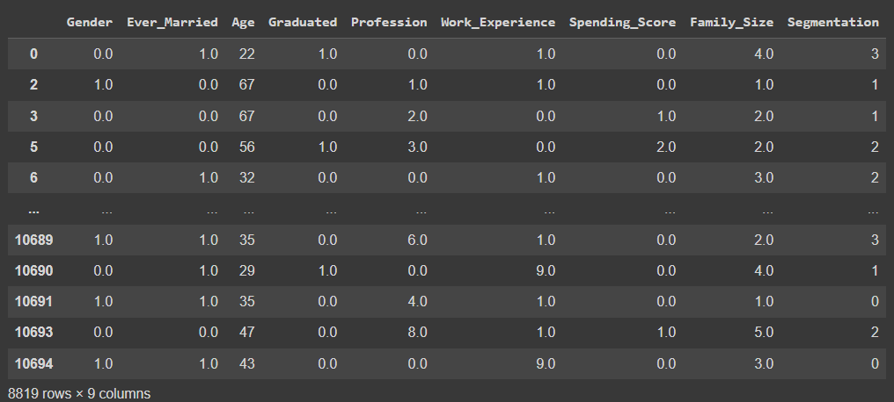

# Developing a Neural Network Classification Model

## AIM:

To develop a neural network classification model for the given dataset.

## Problem Statement:

An automobile company has plans to enter new markets with their existing products. After intensive market research, they’ve decided that the behavior of the new market is similar to their existing market.

In their existing market, the sales team has classified all customers into 4 segments (A, B, C, D ). Then, they performed segmented outreach and communication for a different segment of customers. This strategy has work exceptionally well for them. They plan to use the same strategy for the new markets.

You are required to help the manager to predict the right group of the new customers.

## Neural Network Model:


## DESIGN STEPS:

### STEP 1:
 Import the necessary packages & modules, then read the given dataset.

### STEP 2:
 Perform pre processing and clean the dataset

### STEP 3:
 Encode categorical value into numerical values using ordinal/label/one hot encoding

### STEP 4:
 Visualize the data using different plots in seaborn

### STEP 5:
 Normalize the values and split the values for x and y

### STEP 6:
 Build the deep learning model with appropriate layers and depth

### STEP 7:
 Analyze the model using different metrics.

### STEP 8:
 Plot a graph for Training Loss, Validation Loss Vs Iteration & for Accuracy, Validation Accuracy vs Iteration and save model using pickle

### STEP 9:
 Using the DL model predict for some random inputs.

## PROGRAM:
```python
Developed by: Manoj Kumar S
Reg.No: 212221230056

# Libraries:
import pandas as pd
import numpy as np
from sklearn.preprocessing import OrdinalEncoder
from sklearn.preprocessing import LabelEncoder
from sklearn.preprocessing import OneHotEncoder
from sklearn.preprocessing import MinMaxScaler
from sklearn.model_selection import train_test_split

import matplotlib.pyplot as plt
import tensorflow as tf
from tensorflow.keras.models import Sequential
from tensorflow.keras.models import load_model
from tensorflow.keras.layers import Dense
from tensorflow.keras.layers import Dropout
from tensorflow.keras.layers import BatchNormalization
from tensorflow.keras.callbacks import EarlyStopping

# Pre-Processing:
customer_data=pd.read_csv("customers.csv")
customer_data
customer_data.columns
customer_data.dtypes
customer_data.shape
customer_data.isnull().sum()
customer_data_cleaned=customer_data.dropna(axis=0)
customer_data_cleaned.isnull().sum()
customer_data_cleaned.shape
customer_data_cleaned.dtypes

# Encoding Categorical Values:
customer_data_cleaned['Gender'].unique()
customer_data_cleaned['Ever_Married'].unique()
customer_data_cleaned['Graduated'].unique()
customer_data_cleaned['Profession'].unique()
customer_data_cleaned['Spending_Score'].unique()
customer_data_cleaned['Var_1'].unique()
customer_data_cleaned['Segmentation'].unique()
categories_list=[['Male','Female'],['Yes','No'],['Yes','No'],['Healthcare', 'Engineer', 'Lawyer', 'Artist', 'Doctor',
       'Homemaker', 'Entertainment', 'Marketing', 'Executive'],['Low', 'High', 'Average']]

enc=OrdinalEncoder(categories=categories_list)
customer_1=customer_data_cleaned.copy()
customer_1[['Gender','Ever_Married','Graduated','Profession','Spending_Score']]=enc.fit_transform(customer_1[['Gender','Ever_Married','Graduated','Profession','Spending_Score']])
customer_1.dtypes
le=LabelEncoder()
customer_1['Segmentation']=le.fit_transform(customer_1['Segmentation'])
customer_1.dtypes
customer_1=customer_1.drop('ID',axis=1)
customer_1=customer_1.drop('Var_1',axis=1)
customer_1

# Assign X & Y values:
X=customer_1[['Gender','Ever_Married','Age','Graduated','Profession','Work_Experience','Spending_Score','Family_Size']].values
y1=customer_1[['Segmentation']].values
y1[10]
one_hot_enc=OneHotEncoder()
one_hot_enc.fit(y1)
y=one_hot_enc.transform(y1).toarray()
X_train,X_test,y_train,y_test=train_test_split(X,y,test_size=0.33,random_state=50)
X_train[0]
X_train.shape
scaler_age=MinMaxScaler()
scaler_age.fit(X_train[:,2].reshape(-1,1))
X_train_scaled=np.copy(X_train)
X_test_scaled=np.copy(X_test)
X_train_scaled[:,2] = scaler_age.transform(X_train[:,2].reshape(-1,1)).reshape(-1)
X_test_scaled[:,2] = scaler_age.transform(X_test[:,2].reshape(-1,1)).reshape(-1)

# Building Model:
ai = Sequential([Dense(50,input_shape = [8]),
                 Dense(40,activation="relu"),
                 Dense(30,activation="relu"),
                 Dense(20,activation="relu"),
                 Dense(4,activation="softmax")])
ai.compile(optimizer='adam',
           loss='categorical_crossentropy',
           metrics=['accuracy'])
early_stop = EarlyStopping(
    monitor='val_loss',
    mode='max', 
    verbose=1, 
    patience=20)
ai.fit( x = X_train, y = y_train,
        epochs=500, batch_size=256,
        validation_data=(X_test,y_test),
        callbacks = [early_stop]
        )

# Analyze the model:
metrics = pd.DataFrame(ai.history.history)
metrics.head()
metrics[['loss','val_loss']].plot()
plt.title('Training Loss, Validation Loss Vs Iteration')
metrics[['accuracy','val_accuracy']].plot()
plt.title('Accuracy, Validation Accuracy Vs Iteration')
x_pred = np.argmax(ai.predict(X_test), axis=1)
x_pred.shape

y_truevalue = np.argmax(y_test,axis=1)
y_truevalue.shape
from sklearn.metrics import classification_report as report
from sklearn.metrics import accuracy_score as acc
from sklearn.metrics import confusion_matrix as conf

conf(y_truevalue,x_pred)
print(report(y_truevalue,x_pred))

# Saving the model:
import pickle
ai.save('customer_classification_model.h5')

with open('customer_data.pickle', 'wb') as fh:
   pickle.dump([X_train,y_train,X_test,y_test,customer_data,customer_data_cleaned,scaler_age,enc,one_hot_enc,le], fh)

ai_brain = load_model('customer_classification_model.h5')

with open('customer_data.pickle', 'rb') as fh:
   [x_train,y_train,X_test,y_test,customer_data,customer_data_cleaned,scaler_age,enc,one_hot_enc,le]=pickle.load(fh)

# Sample Prediction:
x_prediction = np.argmax(ai_brain.predict(X_test[1:2,:]), axis=1)
print(x_prediction)
print(le.inverse_transform(x_prediction))

```

## Dataset Information:

### After Converted into Numerical values:


## OUTPUT:

### Training Loss, Validation Loss Vs Iteration Plot:


### Classification Report:


### Confusion Matrix:

### New Sample Data Prediction:

## RESULT:
A neural network classification model is developed for the given dataset.